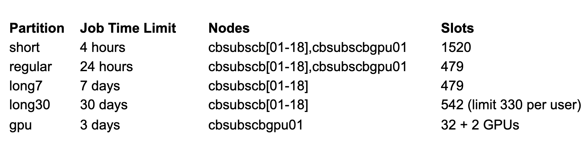

Messer lab cluster tutorial
================

- <a href="#resources" id="toc-resources">Resources</a>
- <a href="#first-things-first-cluster-etiquette"
  id="toc-first-things-first-cluster-etiquette">First things first:
  cluster etiquette</a>

## Resources

1.  [Detailed cluster tutorial by Nicholas and Isabel (written in
    2021)](https://github.com/therkildsen-lab/user-guide/blob/master/slurm_tutorial/slurm.md)

- This includes notes on how the cluster is organized, how to log into
  the cluster, the different `#SBATCH` headers available, how to set up
  a job array, how to request/use an interactive session with `salloc`,
  and more.

2.  [BioHPC guide on their
    website](https://biohpc.cornell.edu/lab/cbsubscb_SLURM.htm)

3.  [Recordings of past BioHPC
    workshops](https://biohpc.cornell.edu/login_bio.aspx?ReturnURL=/lab/medialist.aspx)

4.  [List of software installed on the cluster & notes on how to use
    them](https://biohpc.cornell.edu/lab/userguide.aspx?a=software)

## First things first: cluster etiquette

``` r

```

 Cluster members find
it extremely annoying when one person is taking *all* slots of a job
partition, thus preventing other jobs submitted to that partition from
running. As a good rule of thumb, please make sure that your job does
not use more than 20% of the available slots on your partition. This
percentage can be raised if the cluster is super free one day (ex:
holidays) or if your jobs are extremely quick.
