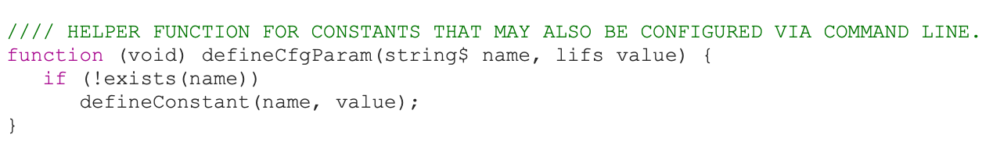

Messer lab cluster tutorial
================

- <a href="#resources" id="toc-resources">Resources</a>
- <a href="#first-things-first-cluster-etiquette"
  id="toc-first-things-first-cluster-etiquette">First things first:
  cluster etiquette</a>
- <a href="#running-slim-on-the-cluster"
  id="toc-running-slim-on-the-cluster">Running SLiM on the cluster</a>

## Resources

1.  [Detailed cluster tutorial by Nicholas and Isabel (written in
    2021)](https://github.com/therkildsen-lab/user-guide/blob/master/slurm_tutorial/slurm.md)

- This includes notes on how the cluster is organized, how to log into
  the cluster, the different `#SBATCH` headers available, how to set up
  a job array, how to request/use an interactive session with `salloc`,
  and more.

2.  [BioHPC guide on their
    website](https://biohpc.cornell.edu/lab/cbsubscb_SLURM.htm)

3.  [Recordings of past BioHPC
    workshops](https://biohpc.cornell.edu/login_bio.aspx?ReturnURL=/lab/medialist.aspx)

4.  [List of software installed on the cluster & notes on how to use
    them](https://biohpc.cornell.edu/lab/userguide.aspx?a=software)

## First things first: cluster etiquette

``` r
knitr::include_graphics("figures/cluster-partitions.png")
```

 Cluster
members find it extremely annoying when one person is taking *all* slots
of a job partition, thus preventing other jobs submitted to that
partition from running. As a good rule of thumb, please make sure that
your job does not use more than 20% of the available slots on your
partition. This percentage can be raised if the cluster is super free
one day (ex: holidays) or if your jobs are extremely quick.

## Running SLiM on the cluster

- Multiple versions of SLiM are available on the cluster. [This
  page](https://biohpc.cornell.edu/lab/userguide.aspx?a=software&i=411#c)
  provides the commands for 5 different SLiM versions.

- To vary parameters in SLiM, parse SLiM output, and save your desired
  summary statistics, you can follow Sam’s pipeline:

1.  Copy and paste Sam’s `defineCfgParam` function into your SLiM script
    (see
    [distant_site_pan_TA.slim](slim-example/distant_site_pan_TA.slim)):

``` r

```

 In your SLiM
`initialize()` callback, define any parameter that you want to vary with
`defineCfgParam("PARAMETER_NAME", DEFAULT_VALUE)`. For example, if I
wanted to vary the germline resistance rate in a gene drive model but
have a default value of 0.9, I’d do
`defineCfgParam("GERMLINE_RESISTANCE_RATE", 0.9)`.
